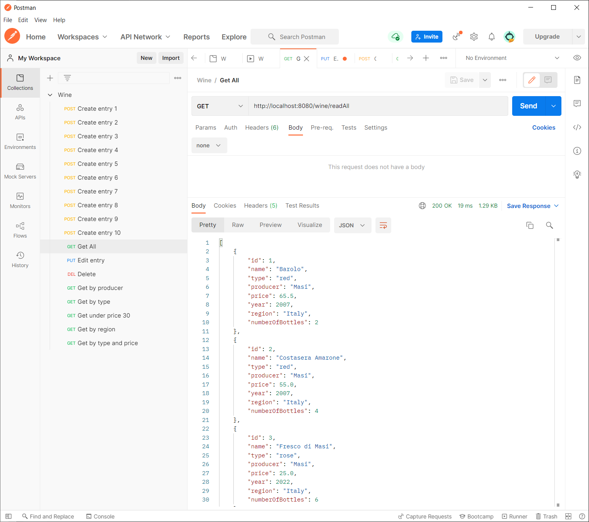
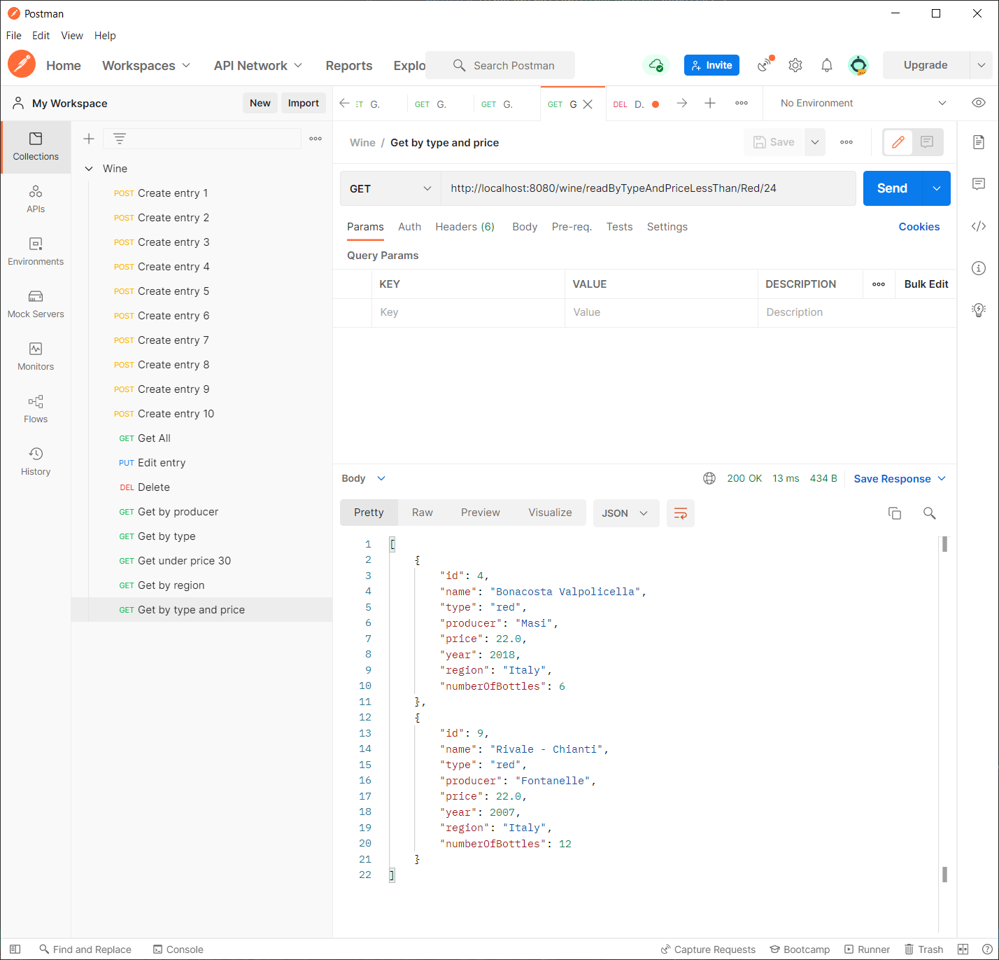

# ContieroCellar
A REST service in Spring that controls CRUD operations on MySQL table.

## Why are we doing this?

The aim of this project is to fulfil the requirements for the completion of QA Academy Bootcamp. 

The objective is to create a Spring Boot REST API, with utilisation of supporting tools, methodologies, and technologies, that encapsulates all fundamental and practical modules covered during training.

## How I expected the challenge to go.

## What went well? / What didn't go as planned?

## Possible improvements for future revisions of the project.

## Screenshots of postman requests with the output from the API.

### Test 1 - Create Wine entity

### Test 2 - Read all wine entries

### Test 3 - Edit entry

### Test 4 - Delete entry

### Test 5 - Get wine entry by type

### Test 6 - Get entries cheaper than amount

### Test 7 - Get entries by region

### Test 8 - Get entries by type and under price

### Test 9 - Get entries by producer

## Screenshots of database.

## Screenshot of test results.

Tests were run from the command line using `./mvnw test` and the output was collected and located in [doc/test.log](doc/test.log)

## Link to Jira Board. 

https://contieroelza.atlassian.net/jira/software/projects/CC/boards/4/backlog

