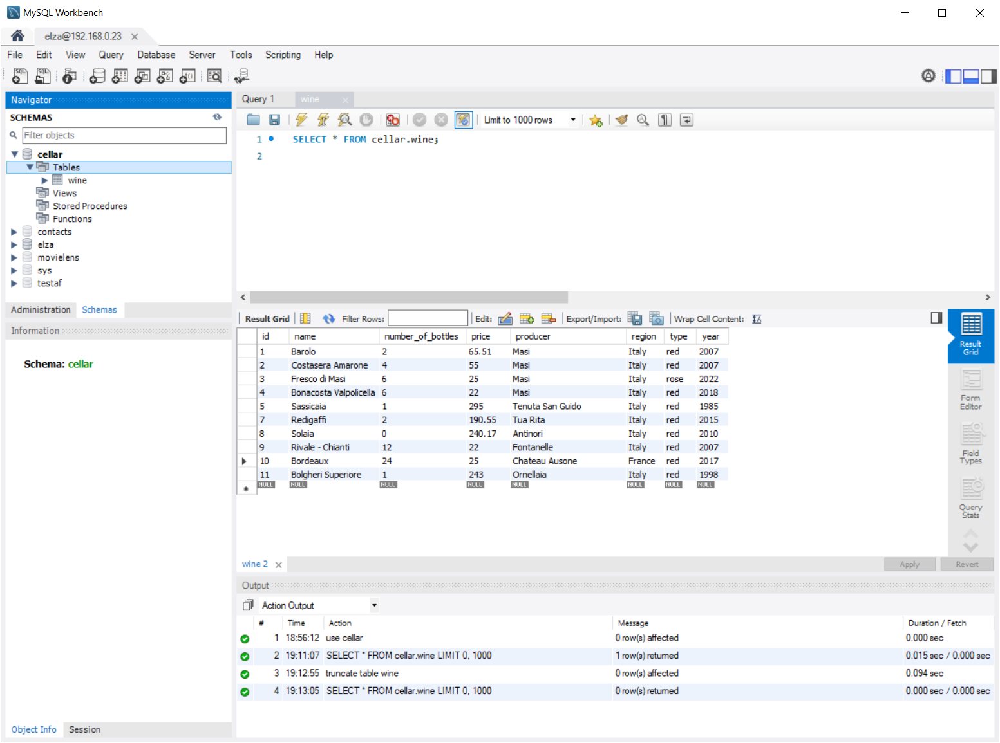

# Contiero Cellar

This project implements a REST service in Spring framework to control CRUD operations on a MySQL table containing 

## Why are we doing this?

This project is part of the requirements for the completion of QA Academy Bootcamp where the fundamentals of software engineering were covered.

The objective is to create a Spring Boot REST API, with utilisation of supporting tools, methodologies, and technologies, that encapsulates all fundamental and practical modules covered during training.

# QA Academy Requirements

## How I expected the challenge to go.

The expectations for this challenge were that some difficulties would arise in the course of the implementation of some technical tasks. However, with the various learning resources which have been made available during this training by QA Academy, coupled with the help of attentive instructors, it was possible to overcome most of the problems during the implementation. 

## What went well? / What didn't go as planned?

Jira as an Agile project management tool was an important instrument for the planning of the whole project as it allowed to layout the work ahead from the big picture to the fine details.

Having little experience with Spring framework, some tasks took more effort to implement than originally expected. This happened, for example, during the development of the first action: creating an entity (`/wine/create`) where much more code was needed than expected. As a result, part of this code was later reused by other actions making subsequent tasks less time consuming. 

Another similar example was the layout of tasks to develop the code for updating specific fiels in the entity *Wine*. This proved to be not relevant, as an update was in fact implemented at once, not one per field/property.

## Possible improvements for future revisions of the project.

Include statistics of the Cellar such as: total number bottles, total value of the cellar, the most expensive and cheapest wine. 

## Screenshots of postman requests with the output from the API.

### Test 1 - Create Wine entity

### Test 2 - Read all wine entries

### Test 3 - Edit entry

### Test 4 - Delete entry

### Test 5 - Get wine entry by type

### Test 6 - Get entries cheaper than amount

### Test 7 - Get entries by region

### Test 8 - Get entries by type and under price

### Test 9 - Get entries by producer

## Screenshots of database.

## Screenshot of test results.

Tests were run from the command line using `./mvnw test` and the output was collected and located in [doc/test.log](doc/test.log)

## Link to Jira Board. 

https://contieroelza.atlassian.net/jira/software/projects/CC/boards/4/backlog

## ERD Diagram

Entity Relationship Diagram for the database.

|**Wine**| |
|-|-|
|ID|BIGINT AUTOINCREMENT PRIMARY KEY|
|NAME|VARCHAR(255) NOT NULL|
|NUMBER_OF_BOTTLES | INT| 
|PRICE | DOUBLE | 
|PRODUCER | VARCHAR(255) |
|REGION | VARCHAR(255) |
|TYPE | VARCHAR(255) |
|YEAR | INT |
